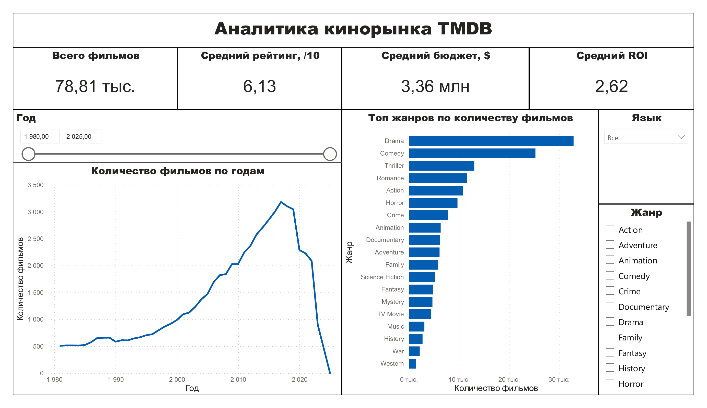
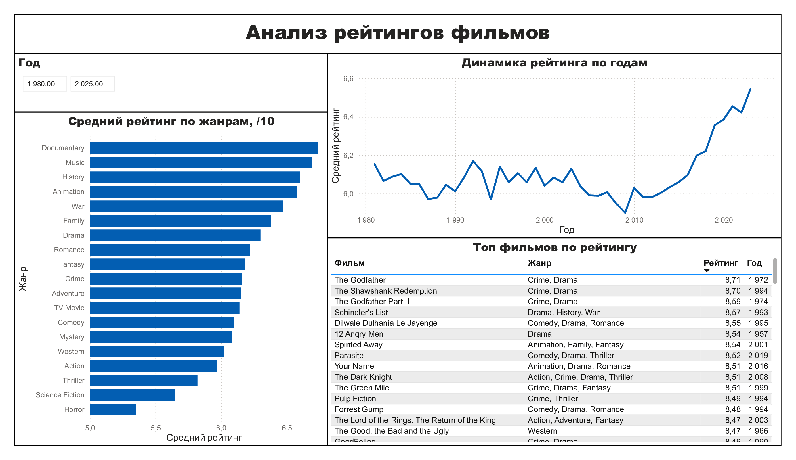
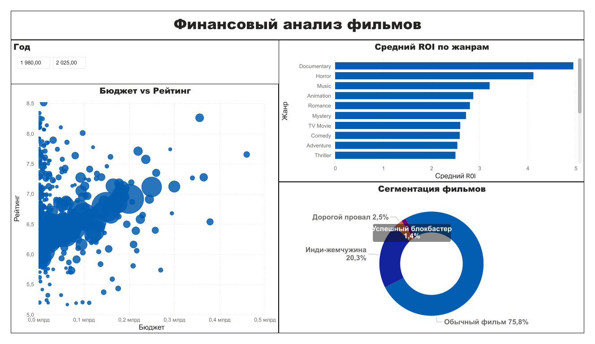

# Аналитика кинорынка на основе данных TMDB — SQL + Power BI

Исследование кинорынка на основе датасета TMDB: нормализация данных в реляционную БД, SQL-анализ с оконными функциями, интерактивный дашборд в Power BI.

---

## Дашборд

| Обзор рынка | Анализ рейтингов |
|---|---|
|  |  |



[Скачать полный дашборд (PDF)](images/dashboard_preview.pdf)

---

## О проекте

Проект представляет собой полный BI-пайплайн: от сырых данных в CSV до интерактивного дашборда в Power BI. Датасет TMDB содержит информацию о более чем 1 000 000 фильмов — бюджеты, кассовые сборы, рейтинги, жанры, даты выхода.

Ключевые вопросы исследования:
- Какие жанры получают наивысшие зрительские оценки?
- Как менялось количество фильмов и их рейтинги с 1980 по 2024 год?
- Какие жанры наиболее прибыльны относительно вложений (ROI)?
- Какие сегменты существуют на кинорынке?
- Есть ли связь между бюджетом фильма и его рейтингом?

---

## Ключевые находки

- Documentary и Music — лидеры по среднему рейтингу (6.7+), опережают Horror (5.35) на 1.4 балла
- Horror — самый прибыльный жанр по ROI (4.3x) при низких бюджетах
- Бюджет не влияет на рейтинг — scatter plot показывает горизонтальное облако точек без выраженного тренда
- Рынок поляризован: 75.8% фильмов — «обычные», лишь 1.4% становятся успешными блокбастерами
- Рост рейтингов с 2017 года — средний рейтинг вырос с 6.0 до 6.5+

---

## Структура репозитория

```
tmdb-sql-powerbi/
├── data/
│   └── .gitkeep              # CSV не включён — скачай с Kaggle
├── sql/
│   └── genre_analysis.sql    # SQL-запросы
├── notebooks/
│   └── prepare_database.ipynb # Python: CSV → SQLite
├── dashboard/
│   └── tmdb_analysis.pbix    # файл Power BI
├── images/
│   ├── page1_overview.png
│   ├── page2_ratings.png
│   ├── page3_finance.png
│   └── dashboard_preview.pdf
└── README.md
```

---

## Структура базы данных

```
films                — основная таблица фильмов
film_genres          — связь многие-ко-многим (film_id, genre)
financial_metrics    — прибыль и ROI для фильмов с известным бюджетом
genre_stats          — агрегированная статистика по жанрам
roi_by_genre         — ROI по жанрам
genres_combined      — жанры фильма склеены в одну строку
```

---

## SQL-анализ

5 аналитических запросов в файле [`sql/genre_analysis.sql`](sql/genre_analysis.sql):

- Общая статистика по жанрам (GROUP BY + HAVING)
- Динамика рынка по годам (оконная функция — скользящее среднее)
- Топ-3 фильма по ROI в каждом жанре (RANK + PARTITION BY)
- Сегментация кинорынка (CASE WHEN)
- Фильмы выше среднего рейтинга своего жанра (подзапрос)

---

## Дашборд Power BI — 3 страницы

**Страница 1 — Обзор рынка**
KPI-карточки, динамика количества фильмов по годам (1980–2024), топ жанров по количеству фильмов, срезы по жанру, году и языку.

**Страница 2 — Анализ рейтингов**
Средний рейтинг по жанрам, динамика среднего рейтинга по годам, топ-20 фильмов по рейтингу.

**Страница 3 — Финансовый анализ**
Scatter plot бюджет vs рейтинг, средний ROI по жанрам, сегментация кинорынка.

---

## Стек технологий

| Инструмент | Назначение |
|---|---|
| Python 3.10+ | Подготовка и трансформация данных |
| pandas | Обработка DataFrame, создание таблиц |
| SQLite | Реляционная база данных |
| SQL | Аналитические запросы (оконные функции, подзапросы, CASE WHEN) |
| Power BI Desktop | Интерактивный дашборд |
| Jupyter Notebook | Среда разработки |

---

## Данные

Источник: [Full TMDB Movies Dataset 2024](https://www.kaggle.com/datasets/asaniczka/tmdb-movies-dataset-2023-930k-movies) — Kaggle, автор asaniczka.

После предобработки: 78 814 фильмов с не менее чем 10 оценками. Финансовые данные: 8 825 фильмов с известным бюджетом и сборами (выбросы по ROI удалены методом перцентилей).

---

## Автор

**Мишанов Максим** — Финансовый университет при Правительстве РФ
